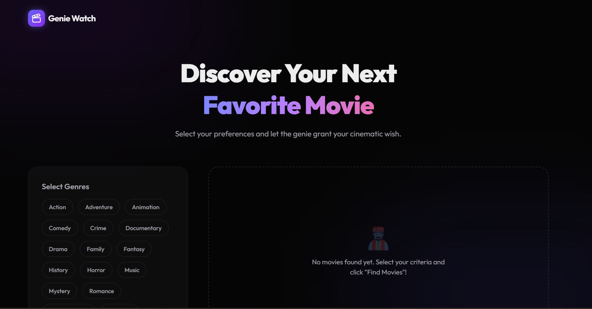

# 🧞‍♂️ Genie Watch

Genie Watch is a premium movie discovery platform that helps users find their next favorite cinematic experience. With advanced filtering by genres, ratings, and release years, the "Genie" grants your cinematic wishes with high-quality, randomized suggestions.



## ✨ Features

- **Advanced Search**: Filter by multiple genres, minimum rating, and specific year ranges (Start/End).
- **Smart Discovery**: Uses random page harvesting and Fisher-Yates shuffling to ensure you always see fresh content.
- **Deduplication**: Remembers what you've seen and avoids showing the same movies within a 30-minute window (stored in LocalStorage).
- **IMDb Integration**: Sourced ratings directly from IMDb (via OMDB API) or falls back to TMDB ratings for accuracy.
- **Performance Optimized**: Features a Prisma-based caching layer to store movie metadata and ratings locally, reducing external API latency.
- **Premium UI/UX**: Built with Next.js, Framer Motion for smooth animations, and a sleek glassmorphic dark mode design.

## 🚀 Getting Started

### Prerequisites

- Node.js (v18+)
- PostgreSQL Database
- TMDB API Token ([Get one here](https://www.themoviedb.org/documentation/api))
- OMDB API Key ([Get one here](http://www.omdbapi.com/apikey.aspx))

### Setup Instructions

1.  **Clone the Repository**:
    ```bash
    git clone <repository-url>
    cd genie-watch
    ```

2.  **Install Dependencies**:
    ```bash
    npm install
    ```

3.  **Environment Variables**:
    Copy the example environment file and fill in your credentials:
    ```bash
    cp .env.example .env
    ```
    *Make sure to provide your `DATABASE_URL`, `TMDB_ACCESS_TOKEN`, and `OMDB_API_KEY`.*

4.  **Database Initialisation**:
    Push the Prisma schema to your database:
    ```bash
    npx prisma db push
    ```

5.  **Run Development Server**:
    ```bash
    npm run dev
    ```

6.  **Open the App**:
    Navigate to [http://localhost:3000](http://localhost:3000).

## 🛠️ Tech Stack

- **Framework**: Next.js 16 (App Router)
- **Database**: PostgreSQL (Prisma ORM)
- **Styling**: Tailwind CSS
- **Animations**: Framer Motion
- **Icons**: Lucide React
- **API**: Axios

---

*Made with 🪄 by Gokul*
